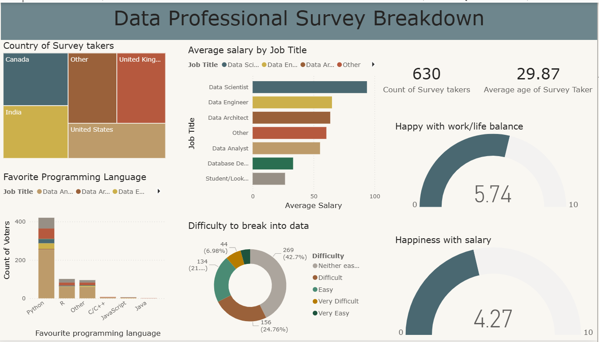

# Data Professional Survey Analysis

## 📊 Project Overview
An interactive Power BI dashboard analyzing survey responses from 600+ data professionals across multiple countries to identify industry trends, salary insights, and career preferences in the data analytics field.

## 🎯 Objective
To understand the current landscape of data professional roles including:
- Average salaries by job title and geographic location
- Most popular programming languages among data professionals
- Work-life balance satisfaction levels
- Career entry barriers and transition patterns
- Demographics and educational backgrounds

## 📁 Dataset
- **Source:** Data Professional Survey (publicly available dataset)
- **Size:** 630 responses, 11 columns
- **Key Fields:** Country, Job Title, Current Salary, Favorite Programming Language, Difficulty to Break Into Data, Happiness with Work-Life Balance, Happiness with Salary, Industry, Years of Experience, Education Level
- **Format:** Excel (.xlsx)

## 🛠️ Tools & Technologies
- **Power BI Desktop:** Dashboard creation and interactive visualization
- **Power Query:** Data cleaning, transformation, and preparation
- **DAX (Data Analysis Expressions):** Calculated measures and custom metrics

## 📝 Methodology

### Data Cleaning & Transformation (Power Query)
- Removed duplicate survey responses and incomplete entries
- Standardized job titles for consistency (e.g., "Data Analyst", "Data Scientist", "Data Engineer")
- Parsed and converted salary ranges into numeric values for aggregation
- Split multi-value fields (programming languages) for proper analysis
- Handled missing values by excluding from specific visualizations where appropriate
- Created calculated columns for salary bands and experience categories
- Standardized country names and removed inconsistent entries

### Dashboard Design & Visualization
- Designed clean, professional layout with consistent color scheme
- Created card visuals displaying key metrics:
  - Total number of survey takers
  - Average age of respondents
  - Average salary across all roles
- Built interactive bar charts:
  - Average salary by job title
  - Favorite programming language distribution
  - Country of survey participants
- Developed gauge charts for satisfaction metrics:
  - Work-life balance happiness rating
  - Salary satisfaction rating
- Added treemap visualization showing difficulty breaking into data field
- Implemented slicers for filtering by job title, country, and other dimensions

### DAX Measures Created
```DAX
Average Salary = AVERAGE('Survey Data'[Salary])
Total Respondents = COUNTROWS('Survey Data')
Average Age = AVERAGE('Survey Data'[Age])
Avg Work-Life Balance = AVERAGE('Survey Data'[Work-Life Balance Score])
```

## 💡 Key Insights

### 1. Salary Analysis
- **Data Scientists** earn the highest average salary at approximately $95K USD
- **Data Engineers** follow closely at $88K USD average
- **Data Analysts** have an average salary of $70K USD
- **Students/Job Seekers** expectedly show lower averages at $27K USD
- Clear salary progression based on role complexity and seniority

### 2. Programming Language Preferences
- **Python** is the overwhelming favorite at 59% of respondents
- **R** is the second most popular at 15%
- **Other languages** (JavaScript, Java, C++) collectively represent 26%
- SQL is universally used across all roles (assumed as baseline skill)
- Python's dominance reflects industry trends toward versatile, general-purpose languages

### 3. Geographic Distribution
- **United States** has the highest number of survey respondents (261 participants)
- **India** is the second largest group (73 participants)
- **United Kingdom**, **Canada**, and other countries show smaller but significant representation
- Geographic diversity provides global perspective on data roles

### 4. Work-Life Balance & Satisfaction
- Average work-life balance rating: **5.7/10** (moderate satisfaction)
- Average salary happiness: **4.3/10** (below average satisfaction)
- Gap between work-life balance and salary satisfaction suggests compensation concerns
- Data Engineers report slightly higher satisfaction across both metrics

### 5. Career Entry Difficulty
- **43%** of respondents found breaking into data "Difficult"
- **25%** rated it as "Very Difficult"
- **21%** found it "Neither easy nor difficult"
- Only **11%** combined found it "Easy" or "Very Easy"
- Highlights the competitive nature and skill requirements of data roles

### 6. Demographics
- Average age of data professionals: **29.87 years**
- Indicates relatively young workforce with room for career growth
- Mix of early-career professionals and experienced practitioners

## 📸 Dashboard Preview



*Interactive Power BI dashboard featuring salary comparisons, programming preferences, and satisfaction metrics*

**Dashboard Features:**
- Clean, professional design with consistent color palette
- Interactive filtering capabilities
- Responsive visualizations that update dynamically
- Easy-to-read KPI cards for quick insights
- Comprehensive view of survey data on a single page

## 🔄 Reproducibility

### Option 1: View Published Dashboard
Access the live dashboard: [Power BI Service Link - *Update with your published link*]

### Option 2: Download and Explore Locally
1. Download the `Data_Professional_Survey.pbix` file from this repository
2. Download Power BI Desktop (free) from Microsoft's official website
3. Open the `.pbix` file in Power BI Desktop
4. Explore the dashboard and underlying data model
5. Modify visualizations or create your own analysis

### Option 3: Recreate from Source Data
1. Download the raw dataset: `survey_data.xlsx`
2. Import into Power BI Desktop
3. Follow the data cleaning steps outlined in the Methodology section
4. Build visualizations based on the insights discovered

## 🚀 Skills Demonstrated

**Technical Skills:**
- Power BI dashboard development and design
- Power Query (M language) for ETL operations
- DAX for calculated measures and KPI creation
- Data modeling and relationship management
- Interactive visualization design
- Data cleaning and standardization

**Analytical Skills:**
- Exploratory data analysis (EDA)
- Identifying trends and patterns in survey data
- Statistical summarization and aggregation
- Data storytelling and insight communication
- Business intelligence reporting

**Design Skills:**
- Dashboard layout and UX principles
- Color theory and visual hierarchy
- Accessibility and readability optimization

## 📈 Future Enhancements

- **Temporal Analysis:** Add year-over-year comparison if historical data becomes available
- **Advanced Segmentation:** Include industry-specific salary breakdowns and role transitions
- **Predictive Analytics:** Incorporate forecasting for salary trends using Power BI's AI features
- **Drill-Through Pages:** Create detailed pages for each job role with granular insights
- **Additional Metrics:** Add cost of living adjustments for geographic salary comparisons
- **Survey Expansion:** Gather more responses to improve statistical significance
- **Mobile Optimization:** Create mobile-friendly version of the dashboard
- **Educational Pathways:** Analyze correlation between education level and salary/satisfaction

## 📚 Learnings & Challenges

**Key Learnings:**
- Importance of data cleaning in ensuring accurate visualizations
- Power Query's efficiency in handling repetitive transformation tasks
- DAX's flexibility in creating custom business metrics
- Dashboard design principles for clarity and user engagement

**Challenges Overcome:**
- Parsing salary ranges with inconsistent formatting
- Handling survey responses with multiple programming language selections
- Balancing information density with visual clarity
- Ensuring cross-filtering works intuitively across all visuals

## 📫 Connect With Me

I'm actively seeking **Data Analyst** opportunities and would love to connect!

- **LinkedIn:** [linkedin.com/in/surabhisingh2306](http://www.linkedin.com/in/surabhisingh2306)
- **Email:** ssurabhisingh23@gmail.com
- **Location:** Mumbai, India

---

## 📝 Project Context

*This project was created as part of my data analytics portfolio to demonstrate Power BI proficiency and data visualization capabilities. As someone transitioning from a Quality Assurance background at Samsung R&D to Data Analytics, this project showcases my ability to extract meaningful insights from survey data and present them in a clear, actionable format.*

---

**License:** This project is available for educational and portfolio purposes.

**Acknowledgments:** Dataset source and inspiration from data analytics community resources.

**Last Updated:** April 2026
